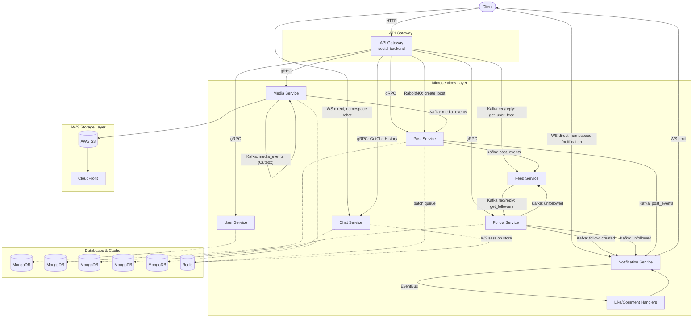

# 🚀 Social Media Backend (Microservices)


[](./LICENSE)


This project is a hands-on study of the architectural patterns used by
large-scale social platforms (Facebook, Instagram, Twitter/X) — event-driven
fan-out, polyglot service communication, and the operational trade-offs
each pattern introduces — implemented at a scope realistic for a single
developer, not at production scale.

## 📑 Table of Contents
- [Overview](#-overview)
- [Architecture](#-architecture)
- [Tech Stack](#-tech-stack)
- [Key Design Decisions](#-key-design-decisions)
- [Security](#-security)
- [Known Limitations](#-known-limitations)
- [Future Roadmap](#-future-roadmap)
- [Getting Started](#-getting-started)
- [API Documentation](#-api-documentation)
- [Testing](#-testing)
- [Project Structure](#-project-structure)
- [Author](#-author)

---

## 📖 Overview
> 🎯 **Project Focus:** This repository prioritizes system architecture, service-to-service communication, and infrastructure design over feature completeness. 

This system communicates through **gRPC** (synchronous calls), **Kafka** (event streaming), and **RabbitMQ** (async command queue). Each service owns its own MongoDB database following the **database-per-service** pattern, supplemented by **Redis** to handle high-throughput like batching and cross-instance WebSocket communications.

### ✨ Core Features
- **Authentication:** JWT-based user auth and profile management.
- **Social Graph:** Follow/unfollow mechanics and personalized feeds.
- **Feed:** Fan-out-on-write personalized feed via Redis Sorted Sets writes new posts into each follower.
- **Engagement:** Posts, comments, and Redis-batched likes.
- **Real-time Chat:** WebSocket (Socket.IO) with Redis adapter for multi-instance scaling.
- **Notifications:** EventBus-driven real-time push notifications, utilizing smart throttling to batch rapid engagements and prevent alert fatigue.
- **Media Processing:** Presigned S3 uploads, async processing (sharp/ffmpeg), and CloudFront CDN delivery.

---

## 🧱 Architecture



Two behaviors worth calling out that aren't obvious from a typical gateway
diagram:
 
- **Chat and Notification WebSocket traffic bypasses the gateway entirely.**
  Both services run their own Socket.IO server on their own port
  (`chat-service` → `/chat` namespace, `notification-service` →
  `/notification` namespace) with a Redis adapter for multi-instance fan-out.
  The gateway only handles the HTTP side of chat — fetching history via gRPC
  — it never proxies the socket connection itself.
- **Feed fan-out is two independent Kafka request/reply hops, not a
  broadcast.** When the gateway needs a user's feed, it sends
  `get_user_feed` directly to `feed-service`. Separately, when
  `feed-service` receives a `post_events` message for a newly created post,
  it calls out to `follow-service` with `get_followers` (also Kafka
  request/reply) to resolve who should see that post before writing it into
  their feeds.

### 🧩 Service Matrix

| Service | Responsibility | Receives | Sends |
|---|---|---|---|
| `social-backend` | API Gateway (Auth, HTTP routing) | HTTP | gRPC (all services); RabbitMQ (`create_post`); Kafka (`get_user_feed`) |
| `user-service` | User accounts, profiles, JWT | gRPC | — |
| `post-service` | Posts, comments, likes | gRPC, RabbitMQ (`create_post`), Kafka (`media_events`) | Kafka (`post_events`) |
| `follow-service` | Follow graph, follower lookups | gRPC, Kafka (`get_followers`) | Kafka (`follow_created`, `unfollowed`) |
| `feed-service` | Personalized feeds | Kafka (`post_events`, `unfollowed`, `get_user_feed`) | Kafka (`get_followers`) |
| `chat-service` | Real-time messaging + history | gRPC (`GetChatHistory`), WS (`send_message`) | — |
| `notification-service`| Real-time push notifications | Kafka (`follow_created`, `post_events`) | WS (throttled per post for likes) |
| `media-service` | S3 uploads, async processing (ffmpeg/sharp) | gRPC, Kafka (`media_events`) | Kafka (`media_events` via Outbox) |

---

## 🔧 Tech Stack

- **Backend:** NestJS, TypeScript
- **Microservices & Messaging:** gRPC, Kafka (Confluent Schema Registry for message contracts), RabbitMQ, WebSocket (Socket.IO + Redis adapter)
- **Databases:** MongoDB (Database-per-service), Redis (Batch queue, WS session store)
- **Cloud & Storage:** AWS S3, CloudFront (Signed URLs)
- **Media Processing:** sharp (Images), ffmpeg (Video)
- **Infrastructure:** Docker, Docker Compose
- **Quality Assurance:** Jest (Unit, Integration & E2E — all via Testcontainers), Swagger/OpenAPI

---

## 🧠 Key Design Decisions

1. **RabbitMQ for Commands, Kafka for Events:** Post creation goes through a single RabbitMQ queue (`post_queue`) as a fire-and-forget command. Everything downstream (follow events, post events, media-ready events) flows through Kafka to leverage its broadcast/fan-out capabilities.
2. **Outbox Pattern & Dead Letter Queue (DLQ):** Media processing retries
   failed jobs a few times; if still unsuccessful, the failure is recorded
   in a DLQ via the outbox pattern. A separate scheduled worker reliably
   publishes all outbox events to Kafka; if that retry is also exhausted,
   the event is flagged for manual review.
3. **Redis-Backed Like Batching (Known Limitation & Future Fix):** `post-service` buffers likes in a Redis list and drains it every 5s using `RPOP`, batching deltas before MongoDB bulk writes. *Limitation:* `RPOP` has a crash-window gap. *Planned Fix:* Migrate to Redis Streams with consumer groups and `XACK` to ensure items are only removed after confirmed processing.
4. **Schema Registry for Event Contracts:** Used Confluent Schema Registry with Avro for Kafka messages. This enforces strict data typing and allows for safe schema evolution, preventing producers from breaking downstream consumers with unexpected payload changes.
5. **Redis Sorted Sets for Feed Fan-out-on-write:** On a new post, `feed-service` writes
   into each follower's `feed:{userId}` sorted set, scored by timestamp so
   the feed stays chronologically ordered without extra sorting, capped at
   the latest 20 items to bound memory per user, with a 7-day TTL so
   inactive users' feeds expire automatically instead of needing a cleanup job.
6. **Idempotency Keys for Toggle Actions:** Like/unlike is a toggle, so a
   network retry of the same click could accidentally flip a successful
   like back into an unlike. Each request carries an idempotency key that caches the result in Redis
for 24h.
7. **Database-per-Service:** Enforced strict service boundaries; all cross-service reads go through gRPC, preventing unauthorized direct database access.
8. **Snowflake IDs & S3 Object Sharding:** Utilized Snowflake IDs for media
   assets and implemented a deterministic hashing strategy (SHA-256
   prefixing). This distributes objects uniformly across 256 logical
   shards (`00`-`ff`) to mitigate AWS S3 hot partition bottlenecks caused
   by sequential time-based IDs.

---

## 🔒 Security

- **Password Hashing:** bcrypt with 10 salt rounds — passwords are never
  stored in plaintext, and hashes remain computationally expensive to
  brute-force even if the database is compromised.
- **Authentication (HTTP & WebSocket):** JWT via Passport (`JwtAuthGuard`)
  protects gateway HTTP routes; `WsJwtGuard` validates the JWT during the
  WebSocket handshake, so real-time chat/notification connections require
  the same auth as HTTP — not open to anonymous sockets.
- **Global Input Validation:** `ValidationPipe` with `whitelist` +
  `forbidNonWhitelisted` strips or rejects any field not declared in a
  DTO, preventing mass-assignment-style payloads from reaching business logic.
- **Security Headers:** `helmet()` applied globally on the gateway.
- **Distributed Rate Limiting:** Redis-backed throttler storage keeps
  limits consistent across multiple gateway instances rather than
  per-process. Global limit is 100 req/min; auth endpoints are stricter —
  register at 3/min, login at 5/min — specifically to slow down
  credential-stuffing and brute-force attempts.
- **Time-Limited Media Access:** S3 presigned upload URLs expire in 5
  minutes; CloudFront delivery uses signed URLs instead of a public
  bucket, so media access is scoped and time-limited.
- **Idempotency Keys for Toggle Actions:** prevents a network retry from
  silently duplicating a state-changing action (see Key Design Decisions).

---

## 🔭 Known Limitations

- **Like batching uses Redis `RPOP`** — has a crash-window gap: if the
  process dies after popping an item but before the MongoDB bulk write
  completes, that like is lost with no recovery. Planned fix: migrate to
  Redis Streams with consumer groups and `XACK`.
- **Outbox/DLQ failure handling is manual** — once the publish-to-Kafka
  retry is exhausted, the event is just flagged for manual review; no
  automated alerting (Slack/PagerDuty) or dashboarding yet.
- **CORS is wide-open (`origin: '*'`)** on both the HTTP gateway and the
  chat WebSocket gateway — acceptable for local development, needs
  scoping to specific frontend origins before any real deployment.
- **No refresh token or early token revocation** — JWTs expire after 1
  hour with no renewal path, and a leaked token can't be invalidated
  before it naturally expires.
- **No TLS on internal gRPC traffic** — service-to-service calls are
  plaintext; fine on a single Docker Compose network, not for a
  multi-host deployment.
- **No correlation/trace ID across service calls** — a request crossing
  gRPC and multiple Kafka request/reply hops can't be traced end-to-end;
  debugging currently means correlating logs by hand. Prerequisite for the
  OpenTelemetry/Jaeger work in the Roadmap.
- **Secrets are stored in plaintext `.env` files** — fine for local
  development, but a real deployment would need a secrets manager (AWS
  Secrets Manager, HashiCorp Vault) for rotation, access auditing, and to
  avoid a single leaked file exposing every credential at once.
- **The `role` field on the user schema isn't enforced anywhere** — no
  `RolesGuard` currently checks it, so it exists in the data model but
  has no effect yet.
- **Feed fan-out is fan-out-on-write only** — no hybrid fan-out-on-read
  path for high-follower accounts, which real systems at this scale
  typically need to avoid write amplification.
- **No dependency vulnerability scanning** (e.g. `npm audit`, Dependabot)
  yet — planned as part of the GitHub Actions CI/CD work in the Roadmap.
- **Test coverage is uneven across services** — see the Testing section
  for what's covered and what's next.

---

## 🧭 Future Roadmap

1. **CI/CD (GitHub Actions):** automated lint/test/build on push.
2. **Observability (OpenTelemetry + Prometheus + Grafana + Jaeger):**
   Instrument services with OpenTelemetry to propagate a trace ID across
   gRPC metadata and Kafka message headers — currently there's no
   correlation ID at all, so a request crossing multiple service hops
   can't be traced end-to-end. Prometheus/Grafana for metrics (Kafka
   consumer lag, outbox publish failures, per-service latency); Jaeger for
   visualizing the traces OpenTelemetry produces.
3. **Load Testing (k6):** Utilize k6 to simulate real-world social media
   traffic spikes and benchmark our architectural decisions. Key testing
   scenarios include:
   - **Engagement Spikes:** Stress-testing the Redis-backed like batching
     mechanism with thousands of concurrent likes to ensure zero data loss
     during MongoDB bulk writes.
   - **Fan-out Latency:** Measuring the time it takes for Kafka to fan-out
     a new post to 10,000+ followers via the `feed-service` Redis Sorted Sets.
4. **Circuit Breakers:** No circuit breaker currently wraps
   the gRPC or Kafka request/reply calls — a downstream outage means every
   request keeps retrying against a service that's already down.
5. **Chaos Engineering:** validate resilience claims that currently rest
   on code review alone — kill the Kafka broker mid-flight to confirm the
   Outbox/DLQ path recovers as designed, kill a service process during the
   Redis `RPOP` batch-drain window to observe actual data loss, and
   confirm circuit breakers trip and recover as expected.
6. **Kubernetes:** migrating from Docker Compose to explore service
   discovery, scaling, and rolling deploys at the orchestration layer.
7. **Elasticsearch:** Integrate Elasticsearch to enable high-performance,
   fuzzy search capabilities. This will handle complex queries like
   searching for users, feed, and post content, effectively offloading
   heavy text-matching workloads from the primary MongoDB databases.
8. **Debezium (CDC):** exploring change-data-capture as an alternative to
   the manual outbox worker for propagating MongoDB writes to Kafka.
  
---
## 🚀 Getting Started

### Prerequisites
- Node.js 20+
- Docker & Docker Compose

### Setup

```bash
git clone https://github.com/kritsadakjt-code/social-media.git
cd social-media
npm install
cp .env.example .env
```
*(Fill in the values in `.env` — see `.env.example` for the full list of required variables.)*

### Run Infrastructure
Start MongoDB, Redis, RabbitMQ, Kafka, Kafka UI, and Schema Registry:
```bash
docker-compose up -d
```

### Run Services
Start the API gateway and all 7 microservices concurrently:
```bash
npm run start:all
```
To run a single service during development:
```bash
npm run start:dev post-service
```
The API Gateway will be available at `http://localhost:3000`.

---

## 📚 API Documentation

Swagger UI is available at `http://localhost:3000/api` once the API Gateway is running.

---

## 🧪 Testing
### 🏃‍♂️ Running Tests

    npm run test          # Run Unit tests 
    npm run test:e2e      # Run E2E tests (Gateway)
    npm run test:cov      # Coverage report

### 📊 Current Coverage

- **Unit Tests:** Focus on areas with critical failure modes — `post-service`'s like-aggregation (RPOP crash-window behavior), `notification-service`'s like-throttling, `feed-service`'s fan-out logic, and utility modules in `media-service` and `chat-service`.
- **Integration Tests:** Utilize Testcontainers to cover `post-service`'s Kafka consumption and like-aggregation against real Redis/Kafka instances.
- **E2E Tests:** The gateway's post-creation flow (`posts.e2e-spec.ts`) is currently the primary substantive suite.*

### 🚀 Next to Cover (Testing Roadmap)

- **Business-logic Unit Tests:** Expand coverage for `follow-service`, `user-service`, and `social-backend` by mocking their Mongo repositories and gRPC clients.
- **Per-Service Integration Suites:** Move beyond the gateway to ensure each microservice is tested in isolation. Since each service owns its database, this requires dedicated Testcontainers setups (Mongo + Kafka) per service, following the `post-service` pattern.
- **Media Service Integration:** Test the S3/CloudFront upload flow using a local S3-compatible container (LocalStack via Testcontainers) to fully validate actual AWS SDK operations without hitting real AWS.
---

## 📁 Project Structure

```text
├── apps/
│   ├── social-backend/         # API Gateway
│   ├── user-service/
│   ├── post-service/
│   ├── follow-service/
│   ├── chat-service/
│   ├── notification-service/
│   ├── feed-service/
│   └── media-service/
└── libs/
    └── shared/                 # Shared DTOs, Kafka schemas, gRPC proto files
```

---
## 👤 Author

**Kritsada**
- Email: [kritsada.kjt@gmail.com](mailto:kritsada.kjt@gmail.com)
- LinkedIn: [linkedin.com/in/kritsada-kjt](https://www.linkedin.com/in/kritsada-kjt/)

## 📄 License
MIT — see [LICENSE](./LICENSE) for details.
